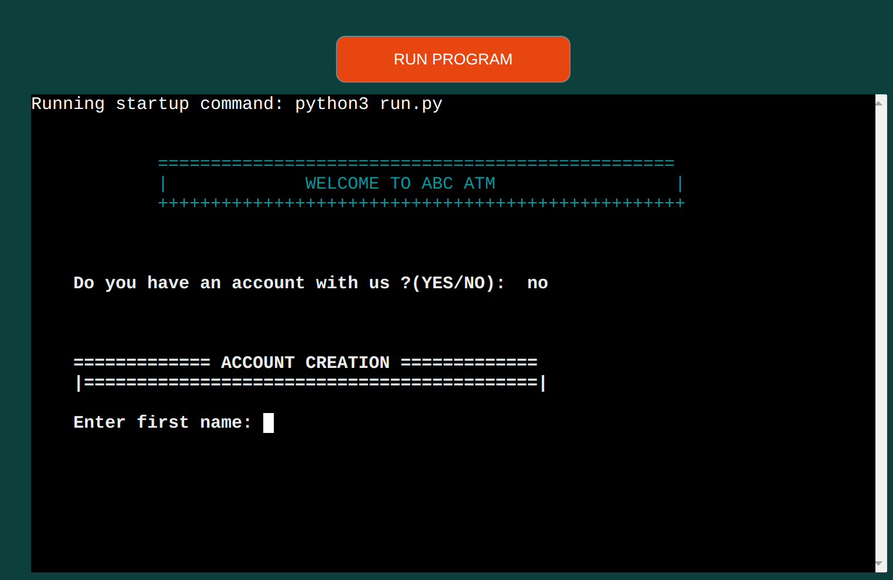

# Abc ATM - Banking System
- [INTRODUCTION](#introduction)
- [USER EXPERIENCE UX](#user-experience-ux)
  * [USER STORIES](#user-stories)
- [SCOPE](#scope)
- [FLOWCHART](#flowchart)
- [FEATURES](#features)
  + [EXISTING FEATURES](#existing-features)
  + [FUTURE FEATURES](#future-features)
- [DATA STORAGE](#data-sorage)
- [BUGS OR ERRORS](#bugs-or-errors)
- [TESTING](#testing)
- [DEPLOYMENT](#deployment)
- [CREDITS](#credits)
- [ACKNOWLEDGEMENTS](#acknowledgements)

## INTRODUCTION
The Abc ATM Banking System is a fictional ATM that combines the partial functionality of a bank and an ATM. The system simulates the creation of a bank account, validates a customer or client account number with a four digit pin and enables logged in customer to deposit or withdraw money. It also displays customer account details and transaction information on a table. The account numbers of users are generated by concatinating a two letter string with a pseudo random 14 digit number. The transaction number is also generated same way.

[The live project can be viewed here](https://natty-congo.herokuapp.com/)

## USER EXPERIENCE UX
### USER STORIES
As a developer I want to create:
* a model of an ATM that will ease clients from the hassle of creating a bank account in addition to its normal functions.

As a general user I want to:
1. Easily navigate through the application
2. Be able to understand the purpose of the application
3. See the correctness of the validation of my input values

During this phase of the project design test repositories were created to try out visuals and initial features before establishing the final respository.

## SCOPE
For the implementation of the ATM banking system I have planned the following features:
- Data from spreadsheet that contains users account and transactions to be displayed to user in tables.
- Account creation starts from the begining of the program, if user has no account.
- User account will be validated, if correct an option screen will be displayed to user otherwise user will be refered back to create an accoount.
- The deposit option enables the user to add money to his/her account on passing the validation of the input data. The value of the amount, status and date time are inserted to the transaction spreadsheet table.
- The withdraw option like the deposit option enables user to remove money from his/her account if the amount input is valid. The amount requested by user, status and date time are inserted to the transactions spreadsheet table.
- The program displays warnings in all stages if input values are not given in the correct format.
- On demand a transaction table is displayed to the account holder if any, showing all his/her transactions with date time, amount and status with reasons if status is failure.

### FLOWCHART
The Flowchart for my program was created using [LucidChart](https://www.lucidchart.com/pages/landing?utm_source=google&utm_medium=cpc&utm_campaign=_chart_en_tier1_mixed_search_brand_exact_&km_CPC_CampaignId=1490375427&km_CPC_AdGroupID=55688909257&km_CPC_Keyword=lucidchart&km_CPC_MatchType=e&km_CPC_ExtensionID=&km_CPC_Network=g&km_CPC_AdPosition=&km_CPC_Creative=442433236001&km_CPC_TargetID=aud-809923745462:kwd-33511936169&km_CPC_Country=20483&km_CPC_Device=c&km_CPC_placement=&km_CPC_target=&gclid=CjwKCAiA2rOeBhAsEiwA2Pl7Q5KsmhzrrvhWJy2CYebbpJzHxt99Tj-XuCHr2wL0hH5yf4c1nGYkMhoCLYgQAvD_BwE) and it visually represents how the system works.

## FEATURES
### EXISTING FEATURES
The programm has a feature that will ease the work of bank workers by not taking the pains of registering every customer.
For simulating a real-life experience, the system is linked to a <b>Google Spreedsheet</b> that can be accessed [here](https://docs.google.com/spreadsheets/d/19-2VbDweehojeCg4YcLQOBKUNskHD-2ef7-phK18IgQ/edit?usp=sharing).

- When the user launches the programm a welcome image is displayed with a question, if the user has an account or not.

- Any input error by the user is caught and the corresponding message is displayed.

- A no answer from the user will prompt the user to create an account.

- A yes answer implies the user has an account and the programm will prompt the user for validation of his/credentials thrice.
If the user is unable to give correct credentials the programm returns back to start welcome question state.

- If a user successfully logs in to the system, the option menu is displayed to the user.

- If the user chooses option 3, his/her account details are displayed in a table for the user.

- If the user chooses option 4, his/her transactions are shown on a table with the date time the transactions where made and there status.

- If the user chooses option 1, he/she will be promted to enter the amount in figures to deposit. The transaction will be inserted to the transaction table.

- If the user chooses option 2, he/she will be prompted to enter the amount in figures, all errors are caught by the programm and the transaction is inserted into the transaction table.

## DATA STORAGE

The data used in this project is stored in google sheet through the google api cloud platform

### FUTURE FEATURES
- Implement a more modern and secure way to save users credentials
- Enable users to do payment of utilities(water,gas, internet, telephone, etc)
- Implement an email message sender to customers about there current account weekly.

### BUGS OR ERRORS
During the development process the desire to give a good user experience was placed as the first piority as a result the code to achieve that aim was refactored several times. Finally this was achieved by introducing the function (do_options) and validating each user input in the (create_user) function.

### TESTING

All the python files where tested in  [pep8](https://pep8ci.herokuapp.com/)

## DEPLOYMENT
- This site was deployed by completing the following steps:
1. Log in to [Heroku](https://id.heroku.com/) or create an account
2. On the main page click the button labelled New in the top right corner and from the drop-down menu   select Create New App
3. You must enter a unique app name
4. Next select your region
5. Click on the Create App button
6. The next page is the project’s Deploy Tab. Click on the Settings Tab and scroll down to Config Vars
7. Click Reveal Config Vars and enter port into the Key box and 8000 into the Value box and click the Add button
8. Click Reveal Config Vars again and enter CREDS into the Key box and the Google credentials into the Value box
9. Next, scroll down to the Buildpack section click Add Buildpack select python and click Save Changes
10. Repeat step 9 to add node.js. o Note: The Buildpacks must be in the correct order. If not click and drag them to move into the correct order
11. Scroll to the top of the page and choose the Deploy tab
12. Select Github as the deployment method
13. Confirm you want to connect to GitHub
14. Search for the repository name and click the connect button
15. Scroll to the bottom of the deploy page and select the preferred deployment type
16. Click either Enable Automatic Deploys for automatic deployment when you push updates to Github

### FORKING 
Fork this project by following the steps:
1. Open [GitHub](https://github.com/)
2. Click on the project to be forked
3. Find the Fork button at the top right of the page
4. Once you click the button the fork will be in your repository

### CLONING
Clone this project by following the steps:
1. Open [GitHub](https://github.com/)
2. On the [repository](https://github.com/Dee68/milestone_project3) click the Code green button, right above the code window
3. You will be provided with three options to choose from, HTTPS, SSH, or GitHub CLI, click the clipboard icon in order to copy the URL
4. In your IDE open Git Bash
5. Enter the command git clone followed by the copied URL
6. The project is cloned.

## CREDITS
- The code for linking to the Google Spreadsheet and manipulating it was taken and adapted from the Code Institute Love Sandwiches tutorial
- The welcome message on the start of the programm was adapted from [ASCII Art generator](https://fsymbols.com/generators/carty/)
- The word_wrap function for animating the text was adapted from [Animated text tutorial](https://www.youtube.com/watch?v=2h8e0tXHfk0)

## ACKNOWLEDGEMENTS
- My mentor for his constructive criticism, his encouragement and inspiring feedbacks.
- My code institute facilitator Irene Neveile for keeping up with my schedules.

  